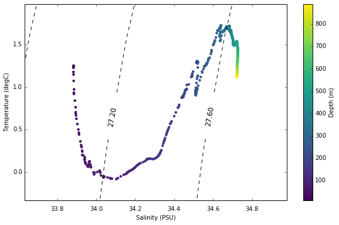
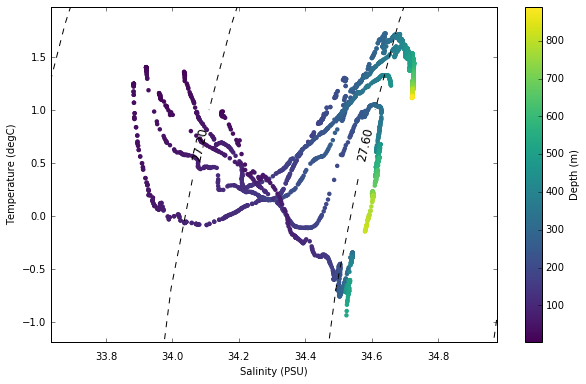

# How to generate Temperature / Salinity plots from World Ocean Database profiles
To view as an ipython notebook visit [here]( http://nbviewer.jupyter.org/github/larsonjl/oceans/blob/master/ts_plot/TS%20%20Plot%20Example.ipynb)
This tutorial shows how to generate TS plots from World Ocean Database CTD casts.  It will show how to compare multiple profiles as well.

This method is an extension of a previous TS diagram method provided by dondiegoibarra [here]( https://oceanpython.org/2013/02/17/t-s-diagram/)


```python
import numpy as np
import matplotlib.pyplot as plt
from netCDF4 import Dataset
from plotting import nice_plots # my module for plot styling, not necessary
import gsw as gsw               # Python seawater package
%matplotlib inline
```

I have downloaded a number of profiles from the World Ocean Database.  All these profiles were taken near the Antarctic Peninsula.  First I will define the profiles I am interested in comparing.


```python
# Directory of CTD profiles
data_dir   = '/Users/jakelarson/Projects/antarctica_ctd/ocldb1465919697.6573.CTD/'

# List of profiles of interest
profile_arr = [ 'wod_016492402O.nc', 'wod_016492402O.nc','wod_016492401O.nc', 'wod_016492400O.nc', \
               'wod_016492399O.nc', 'wod_016492398O.nc']
```

## Single profile example
To start, lets just plot the data from the first cast in our list.  We need to load the cast and determine a few parameters for generating isopycnals.   


```python
# Load data from first cast
data = Dataset(data_dir+profile_arr[0])        # Open the .nc file for the cast of interest
temperature = data.variables['Temperature'][:] # Load temperature data
salinity    = data.variables['Salinity'][:]    # Load salinity data
depth       = data.variables['z'][:]           # Load depth information

# Define the min / max values for plotting isopycnals
t_min = temperature.min() - 1
t_max = temperature.max() + 1
s_min = salinity.min() - 1
s_max = salinity.max() + 1

# Calculate how many gridcells we need in the x and y dimensions
xdim = np.ceil(s_max - s_min)/0.1
ydim = np.ceil(t_max-t_min)
dens = np.zeros((int(ydim),int(xdim)))

# Create temp and salt vectors of appropiate dimensions
ti = np.linspace(0,ydim,ydim)+t_min
si = np.linspace(1,xdim,xdim)*0.1+s_min

# Loop to fill in grid with densities
for j in range(0,int(ydim)):
    for i in range(0, int(xdim)):
        dens[j,i]=gsw.rho(si[i],ti[j],0)

# Subtract 1000 to convert to sigma-t
dens = dens - 1000
```


```python
plt.figure(figsize=(10,6))
CS = plt.contour(si,ti,dens, linestyles='dashed', colors='k')
plt.clabel(CS, fontsize=12, inline=1, fmt='%.2f') # Label every second level
plt.scatter(salinity,temperature, c=depth, cmap=plt.cm.viridis, lw=0)
plt.xlim([s_min + .75, s_max-0.75]); plt.ylim([t_min + 0.75, t_max - 0.75])
plt.xlabel('Salinity (PSU)'); plt.ylabel('Temperature (degC)')
plt.colorbar(label='Depth (m)')
```


    <matplotlib.colorbar.Colorbar at 0x10dd2dfd0>





## Multiple cast TS plots
Here we will do the same as above but add one simple step to plot multiple casts


```python
temp_arr  = []
sal_arr   = []
depth_arr = []
for i in range(len(profile_arr)):
    # Load data from first cast
    data = Dataset(data_dir+profile_arr[i])        # Open the .nc file for the cast of interest
    temp_arr  = np.append(temp_arr, data.variables['Temperature'][:]) # Load temperature data
    sal_arr   = np.append(sal_arr, data.variables['Salinity'][:])    # Load salinity data
    depth_arr = np.append(depth_arr, data.variables['z'][:])          # Load depth information

# Define the min / max values for plotting isopycnals
t_min = temp_arr.min() - 1
t_max = temp_arr.max() + 1
s_min = sal_arr.min() - 1
s_max = sal_arr.max() + 1

# Calculate how many gridcells we need in the x and y dimensions
xdim = np.ceil(s_max - s_min)/0.1
ydim = np.ceil(t_max-t_min)
dens = np.zeros((int(ydim),int(xdim)))

# Create temp and salt vectors of appropiate dimensions
ti = np.linspace(0,ydim,ydim)+t_min
si = np.linspace(1,xdim,xdim)*0.1+s_min

# Loop to fill in grid with densities
for j in range(0,int(ydim)):
    for i in range(0, int(xdim)):
        dens[j,i]=gsw.rho(si[i],ti[j],0)

# Subtract 1000 to convert to sigma-t
dens = dens - 1000

plt.figure(figsize=(10,6))
CS = plt.contour(si,ti,dens, linestyles='dashed', colors='k')
plt.clabel(CS, fontsize=12, inline=1, fmt='%.2f') # Label every second level
plt.scatter(sal_arr,temp_arr, c = depth_arr, cmap=plt.cm.viridis, lw=0)
plt.xlim([s_min + .75, s_max-0.75]); plt.ylim([t_min + 0.75, t_max - 0.75])
plt.xlabel('Salinity (PSU)'); plt.ylabel('Temperature (degC)')
plt.colorbar(label='Depth (m)')
```


    <matplotlib.colorbar.Colorbar at 0x10e18a710>




